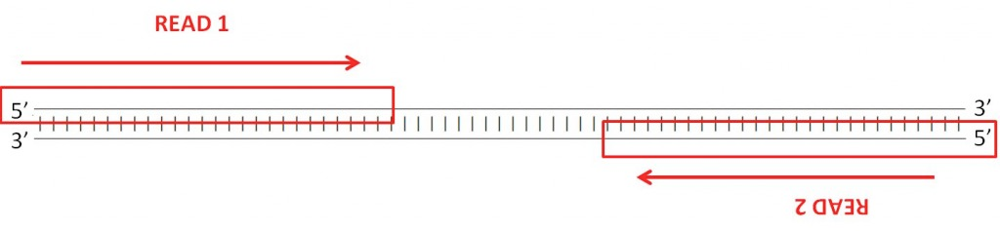

# LAB B4: RNA sequencing and differential gene expression

N.B! Before starting this lab make sure you are registered and logged into Galaxy: https://usegalaxy.org/

## Preparation questions

Study these questions and bring written answers to the lab. See the “Practicals” document for more information.

1. What is RNA sequencing (RNA-seq)? Is it actually RNA that is being sequenced?
1. What is FPKM value? How is it defined and why is it used?
1. If you have a total of 25M reads, and 500 reads map to a specific gene of length 1.7 kbp, what would be the FPKM value of that gene? What if the gene were only 500 bp?

## Instructions and questions

Since you started working on analyzing the mysterious diseases many patients have lost their lives and not much progress has been made in developing a cure. Still, just now, based on your results so far, the drug developmental team believes they have a drug ready for treatment. The drug has been tested on blood samples from the patients and you have been given the task to determine how/if the drug is working or not.

The data you have at hand is RNA sequencing data from three patients both before and after treatment. The computational platform you will be using for the analysis is called [Galaxy](https://usegalaxy.org/), which is a collection of tools that have been made available for online analysis of sequencing data.

The main data you will be working with is mapped sequencing data in bam format. Before we start working on those, let us get a little bit informed about the process from raw sequencing data to mapped data and learn how to work in the Galaxy environment.

Go to https://usegalaxy.org/ or https://usegalaxy.eu and, from the tools panel, upload the file [sample.fastq](./sample.fastq). When the upload has finished, take a look at the data through the “view data” button.

**Q1** Fastq files contain the sequencing data as it is delivered from the sequencing machine. How is the file organized?

It is a good working practice to check the quality of your sequencing data before starting to work with it. A popular tool for that is FastQC. From the toolbox on the left, find the FastQC tool (you can either browse the tools or use the search field). Run it on your newly uploaded data (you can find more information about FastQC at the Babraham Bioinformatics web-page); when it has finished running, take a look at the results.

**Q2** What kind of information can you find in the FastQC report? Does the file fail for any of the modules? If such is the case, is this failure expected?

The first step in an RNA-seq data analysis is to align the FASTQ files against a reference genome, which is in FASTA format. The resulting file from the mapping is a SAM (“Sequence Alignment/Map”) file. There are many tools available to map sequencing reads to a reference genome. Some of the more widely used tools include Tophat and STAR for RNA-seq data, and Bowtie and BWA for DNA data. The process of aligning sequences to a reference genome is a computationally heavy process. Fortunately, we have already carried out the alignment for you and you have the data files at your disposal in BAM format (BAM files are binary versions of SAM files, making them easier to read for the computer).

Before starting any actual analysis, let us take a look at how SAM files are
organized. Upload the [sample.sam](./sample.sam) file to Galaxy and take a look at it. The beginning of the file starts with a header which, among other things, lists the chromosomal and/or contig names of the reference genome that the sequences were aligned to.

#### Q3

Why are there more chromosomes/contigs in the reference genome than there are in the actual human genome?
	Hint: Using the name of one or more of the contigs, see if you can find any information on it on the internet!

Now, look at how the aligned sequences are organized in the SAM file. The first column contains the sequence names, the second column contains the SAM flags, and the third column contains the chromosome that each read was aligned to, followed by the actual location on the chromosome in the forth column. Further on you can see the actual sequence, quality score, and a list of additional attributes.

#### Q4

Find up to six different SAM flags in your file and explain their meaning.
Hint: https://broadinstitute.github.io/picard/explain-flags.html
Note on paired-end data: Today, RNA-sequencing is often paired-end, which means that transcripts are sequenced from both ends. Paired-end sequencing typically results in more robust alignments and variant calling.




Usually, SAM files contain tens or hundreds of million reads. To be better equipped to work with such large files, they are converted into the binary BAM format previously mentioned. BAM files take up much less space than SAM files but are not human-readable. Upload the six BAM files that contain the aligned sequences before and after treatment and run the SAMtools IdxStats software on one of them.

#### Q5

To what chromosomes are the sequences aligned? How many are the aligned sequences?

Next, run the SAMtools flagstat program on the same data.

#### Q6

Are the number of aligned sequences the same as from question five? What are singletons?

Now it is time for the actual differential expression analysis. The idea is to compare the expression profiles between the samples that have been treated with the new drug to those samples that are untreated. To accomplish this, we use a program called Cuffdiff. Start by uploading the supplied GTF file to Galaxy.

#### Q7

What is a gene annotation? What information is in a GTF file?

Open the Cuffdiff program. You need to supply it with the relevant files for each of the conditions and their names. Keep other parameters at default values. When it is set up, you should have three replicates for each condition. The program may take several minutes to run and creates many (~11) different files in the process. When the analysis is done, look through the output and delete those results that have no data. You should be left with four different results files, some of which we will look into in more detail. Cuffdiff reports results both on the gene level and on the isoform/transcript level[^1]. We will start by looking at the “transcript FPKM tracking” results.

[^1]: Isoforms arise from alternative splicing sites in eukaryote genomes. This means that the same gene can give rise to more than one transcript and, if it is protein coding, give rise to more than one protein [(see the wikipedia entry)](http://en.wikipedia.org/wiki/Gene_isoform).

#### Q8

What is the length of the longest and shortest transcripts in this dataset and what are the names of the transcripts? (The Filter and Sort programs can be helpful here)

#### Q9 

What is miRNA?

#### Q10

Which transcripts have the highest expression in each condition? Are these numbers reasonable?

We now switch to the results on the gene level. Look into the gene differential
expression testing results.

#### Q11

How many genes are found to be differentially expressed? How many of those have a higher expression in the untreated samples?

Export the differential gene expression data to a text file. Download the python script “volcano.py” from Canvas. This is a script that creates a so-called volcano plot of the differential expression analysis. The plot shows the -log(p-value) against the log2(fold change) for all genes (the statistically significant genes are highlighted in red, according to an FDR threshold).

Edit the volcano.py file to take the path to your downloaded file as input data and (optionally) change the FDR threshold (it is evident in the file where you need to change things).

Before running the script, activate your Conda environment and install the necessary dependencies:

```bash
$ conda activate bioinfo
$ conda install matplotlib numpy pandas
```

You can then run the file like so:

```bash
$ python volcano.py
```

#### Q12

Show your volcano plot with significant DEGs highlighted. Can you draw any conclusions regarding the effectiveness of the drug? Would you recommend trying it out on patients?
Hint: Copy the gene names and look them up on the internet.

#### Q13

FPKM values are usually in the range 0.1 – 5000. Can you explain the high FPKM values attained in Q10?
Hint: Originally, the data was aligned to the whole genome but the data you have been working with was filtered for a small area of interest on chromosome 2.

In the beginning of these computer labs, you were given the genome sequences of unknown bacteria. You then discovered that these genomes had foreign toxin and foreign antibiotic resistance genes.

#### Q14

What do you think is the most likely explanation for these foreign genes ending up where they did and for what purpose?
