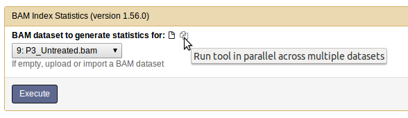

# Bioinformatics Tools Booklet

There is a seemingly endless supply of bioinformatics tools. The field of bioinformatics itself is very broad and, on top of that, there are often many ways of solving a problem, which will be more or less adequate in different scenarios. This list includes all the tools that you need to complete the labs (plus a few extra), but is by no means exhaustive.

Useful commands in the terminal:

| Command            | Description |
|----|----|
| cat *file*          | display an entire file |
| less *file*         | show a file one screen at a time; press q to leave
| pwd                 | path-to-directory; shows you where you are |
| head -n *file*      | displays the first n lines of a file |
| tail -n *file*      | displays the last n lines of a file |
| wc *file*	          | displays number of lines, words and bytes in a file |
| ls                  | shows (**l**i**s**ts) all files in the current directory |
| ls -lh | shows all files in the current directory, including size and permissions |
| cp file1 file2 | makes a **c**o**p**y of file1 called file2 |
| mv file1 file2 | **m***o**v**es file1 to the name or location file2 |
| rm *file*	| erases (**r**e**m**oves) file |
| mkdir dir	| **m**a**k**es a **dir**ectory called dir |
| cd dir | **c**hanges current **d**irectory to dir |
| rmdir dir	| **r**e**m**oves **dir**ectory dir, if it is already empty |
| grep *pattern* *file* | prints all lines of the file that contain the pattern |
| grep -c *pattern* *file* | counts how many lines in the file contain the pattern |

## Prodigal

Prodigal is a gene-finding tool for bacteria and archaea. A special mode can be used for certain bacteria which have non-standard genetic codes. Prodigal outputs the coordinates of the genes found and their translation into protein. To get nucleotide sequences Prodigal can also be run through the command line in the following way:

```bash
$ prodigal -i input_file -d nucleotide_output_file -a aminoacid_output_file
```

Prodigal is available on Bioconda. To install it, run

```bash
$ conda install -c bioconda prodigal 
```

## GenScan: http://hollywood.mit.edu/GENSCAN.html

GenScan is a web-based tool for finding genes and exons in nucleotide sequences. It is meant for vertebrates and certain plants. If the sequences to be scanned are too large, it is possible to download GenScan and run it from the command line.

## BLAST: Basic Local Alignment Search Tool
Blast is a tool for comparing sequences to each other. This can be used simply to compare two sequences or to compare a sequence of interest against a very large database. The standard usage of blast is to compare against a database. The Blast suite includes many different tools, the main ones are:

* Nucleotide blast is used to compare nucleotide sequences against each other. Megablast is optimized for very similar sequences, while less similar sequences can be found using blastn.
* Protein blast is used to compare amino acid sequences against each other. The standard way of doing this is through blastp. The other protein blast tools are designed to find more distantly related proteins (e.g. PSI-blast) by considering the conservation pattern of amino acids and protein domains.
* Other Blast tools are used to compare nucleotide sequences against protein sequences. This is done by translating the nucleotides into proteins in all three possible frames for each DNA strand. 

   + Blastx is used for comparing a nucleotide sequence to a protein database, while
   + Tblastn is used for comparing a protein sequence against a nucleotide database. 
   + Tblastx compares nucleotide sequences against each other, after translating both into protein. This is useful for identifying proteins with similar functions in distantly related organisms.
   
Blast can be run online or locally from the command line. In the latter case, you can build your own database of relevant reference sequences.

## Online BLAST: https://blast.ncbi.nlm.nih.gov

The blast server includes several databases. The most popular ones are nr, which includes every sequence ever submitted to the NCBI servers, and RefSeq, which includes only well annotated, carefully selected references. In some cases, instead of giving single proteins as hits, Blast will give whole annotated genomes. In this case, one must open the genome in question, go to the position of the match (marked in the Blast output) and read the annotation there.

To compare sequences against each other, one must check the box “Align two or more sequences” in online Blast.

## BLAST+

BLAST+ is a set of command line tools that have the same functionality as online Blast but uses custom, locally-built databases.
To format a BLAST database, use the command makeblastdb as follows:

```bash
$ makeblastdb -dbtype type -in input_fasta_file -out database_name
```

where type is either prot (for a protein database) or nucl (for a nucleotide database). Three files will be created with the name database_name plus an extension.
To run a BLAST Nucleotide search, type:

```bash
$ blastn -query query_fasta_file -db database_name -e evalue_threshold -m output_format >output_file
```

The commands blasp, blastx, tblastn, and tblastx can be used analogously. To see all the options available for a given tool, type the name of the desired tool followed by the flag `-help`. Note that the default e-value threshold (10) is very high and will give many false positives. It is usually a good idea to use a much lower value, such as 10e-10.

BLAST+ is available on Bioconda. To install it, run:

```bash
$ conda install -c bioconda blast 
```

## tRNAscan: http://lowelab.ucsc.edu/tRNAscan-SE/

tRNAscan is a tool for identifying transporter RNA in nucleotide sequences. It can be run online or downloaded to be run locally.

tRNAscan is available on Bioconda. To install it, run

```bash
$ conda install -c bioconda trnascan-se 
```

## Barrnap

Barrnap is a tool for finding ribosomal RNA in nucleotide sequences. It can take bacterial, archaeal and eukaryotic sequences.

Barrnap is available on Bioconda. To install it, run

```bash
$ conda install -c bioconda barrnap 
```

## Multiple sequence aligners

* [Mafft](http://www.ebi.ac.uk/Tools/msa/mafft/)
* [Muscle](http://www.ebi.ac.uk/Tools/msa/muscle/)
* [Kalign](http://www.ebi.ac.uk/Tools/msa/kalign/)

These three multiple sequence alignment tools are based in EBI. They run different algorithms in the background, but the user interface is always the same. The sequences to be aligned are pasted on a window or uploaded from a file. Protein and nucleotide sequences are acceptable, in a variety of formats. Several output formats can also be chosen. The most used ones are Fasta and ClustalW. In the clustalw option, you can choose to colour amino acids according to their chemical properties, facilitating the visualization of the alignment.

## Weblogo: http://weblogo.berkeley.edu/logo.cgi

Weblogo is a tool for producing logos of conserved sequences based on short multiple alignments. The fasta or clustalw sequences are pasted or uploaded, and an image is generated of the chosen format and size.

## Pfam: http://pfam.xfam.org/

Pfam is a large database of HMM representations of protein domain families, many of which have extensive annotation. You can search through it by providing an accession number (provided by e.g. online blast), keywords or an amino acid sequence.

## UniProtKB: http://www.uniprot.org/

UniProtKB is a high-quality annotated protein database. The annotation is either done manually (collected in the SwissProt database) or automatically (TrEMBL database).

## TMHMM: http://www.cbs.dtu.dk/services/TMHMM-2.0/

TMHMM is a tool for predicting transmembrane domains by inputting amino acid sequences in fasta format. The output is a list of partitions of your protein sequence into regions inside/outside the cell and regions inside the membrane, together with a plot showing the probability for each amino acid to be placed in each type of region.

## Philius: http://www.yeastrc.org/philius

Philius is a tool for predicting transmembrane domains and signal peptides based on an amino acid sequence (fasta format is supported only by submitting it through an e-mail form). The output is a confidence measure of the sequence being transmembrane and a partitioning of your protein sequence into regions inside/outside the cell and regions inside the membrane, together with a confidence measure for each region (press the "show list" link next to "Predicted protein segments" to view these statistics).

## RDP Classifier: http://rdp.cme.msu.edu/classifier/classifier.jsp 

The Ribosomal Database project is a tool for assigning phylogenety to ribosomal RNA sequences or subsequences. The 16S (SSU) of bacteria and archaea and the 23S (LSU) of fungi can be used. The RDP can take up to 50 thousand sequences at a time. In the results page, clicking on the “detailed view” option will give a bootstrap support to each level of classification. RDP never assigns a species to a sequence, stopping at the genus level.

## RDP Hierarchy browser: http://rdp.cme.msu.edu/hierarchy/hb_intro.jsp

This tool helps you to obtain the ribosomal RNA sequences of many different species out of the Ribosomal Database project. You can search and select the organisms of interest and download their rRNA sequences, which could for example be used for a phylogenetic analysis. For most organisms multiple rRNA sequences are listed, just pick one of them if you want to make a phylogenetic tree.

## Galaxy: https://usegalaxy.org/

Galaxy is an open source, web-based platform for data intensive biomedical research. The interface is divided into three panels; Tools (left), Display (center) and History (right). You use the tools panel to upload data and select tools to run. Every time you upload data or run a tool a new item appears in the History panel. From the History panel you can choose to view your raw data and/or results from the tools you have used which will then be displayed in the Display panel. Some files are in binary format (for example BAM files) and they cannot be viewed. If you choose to view them they will be downloaded to your computer instead.

When you need to execute the same tool on a number of datasets, there is an option available to run them all at once in parallel (as shown in the figure below).


Most/all of the tools available in Galaxy are also available as open source software to be run from the command line. While that may be the ‘standard’ way to run these tools the Galaxy environment is a great platform to get familiar with the programs, data files and the results. 

A good place to start to learn about galaxy is [Galaxy 101](https://usegalaxy.org/u/aun1/p/galaxy101)

Following is a short list of the tools in Galaxy, some of which you will be using through Galaxy in the labs:

* [FastQC](http://www.bioinformatics.babraham.ac.uk/projects/fastqc/)
is a practical tool that allows you to check various quality aspects of your sequencing data prior to any downstream analsysis. The input format for FastQC is sequencing data in the fastq format.
* [STAR](https://code.google.com/p/rna-star/)
is an ultrafast RNA sequencing aligner. It takes in sequencing data in fastq format and aligns the sequences to a reference genome. The output is a list of aligned sequences in SAM/BAM format.
* [Picard Tools](https://broadinstitute.github.io/picard/command-line-overview.html)
is an extensive toolbox that allows various quality checks, analysis and manipulation of aligned sequencing data, usually in BAM or SAM format.
* [SAM tools](http://samtools.sourceforge.net/samtools.shtml)
is an extensive toolbox that allows various quality checks, analysis and manipulation of aligned sequencing data, usually in BAM or SAM format.
* [Cufflinks](http://cole-trapnell-lab.github.io/cufflinks/cuffdiff/)
is a transcript assembler that is it assembles aligned reads into transcripts, i.e introns and exons. It also handles the job of calculating FPKM values for transcripts, both novel and known (annotated) ones. Furthermore, cufflinks includes a module called cuffdiff that calculates differential expression between two (or more) groups.
